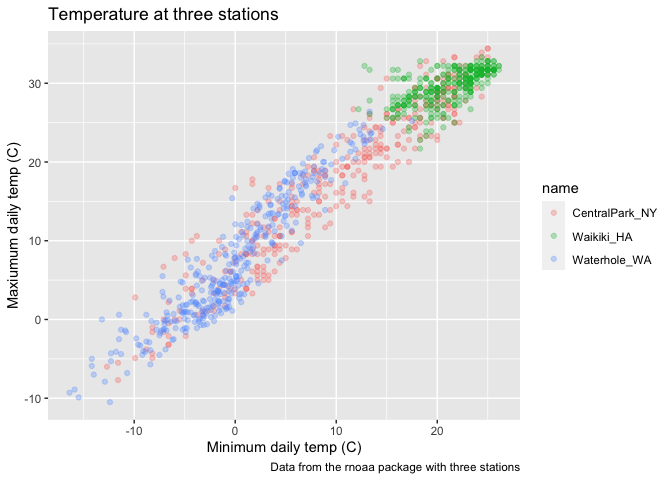
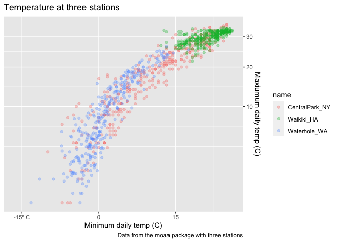
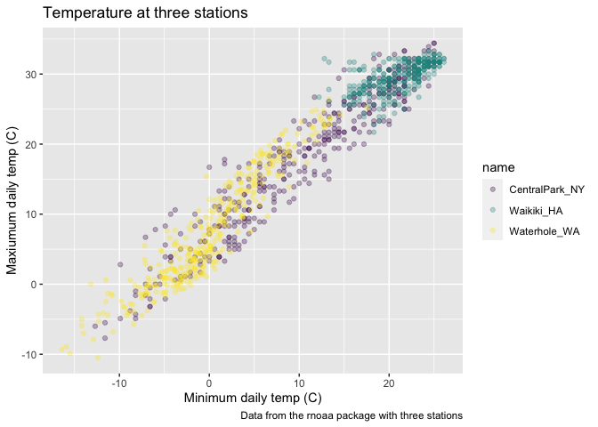
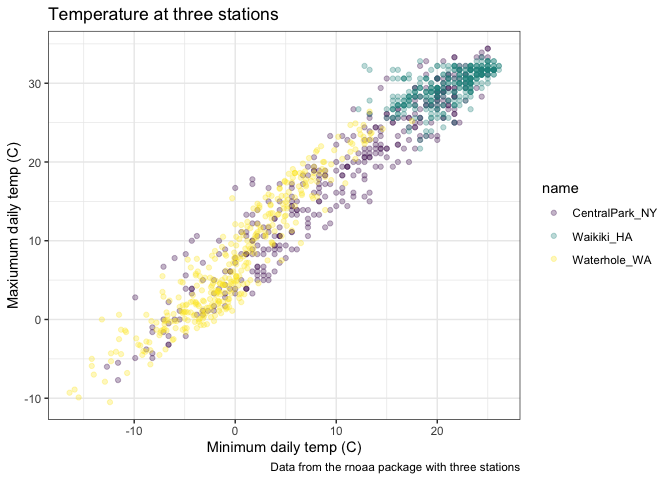
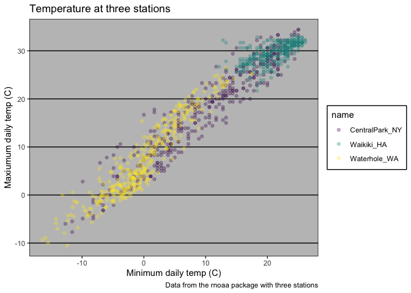
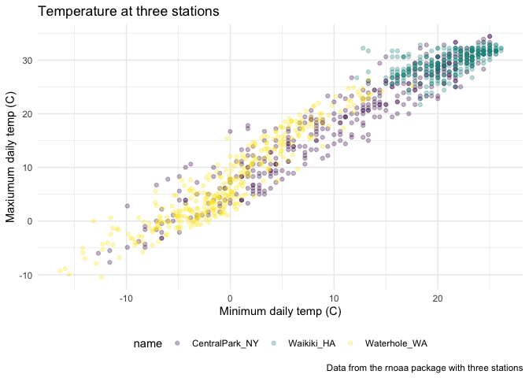

Visualization with ggplot 2
================

``` r
library(tidyverse)
```

    ## ── Attaching packages ─────────────────────────────────────── tidyverse 1.3.1 ──

    ## ✓ ggplot2 3.3.5     ✓ purrr   0.3.4
    ## ✓ tibble  3.1.3     ✓ dplyr   1.0.7
    ## ✓ tidyr   1.1.3     ✓ stringr 1.4.0
    ## ✓ readr   2.0.1     ✓ forcats 0.5.1

    ## ── Conflicts ────────────────────────────────────────── tidyverse_conflicts() ──
    ## x dplyr::filter() masks stats::filter()
    ## x dplyr::lag()    masks stats::lag()

``` r
library(patchwork)
library(viridis)
```

    ## Loading required package: viridisLite

## Start with a familiar one

``` r
weather_df = 
  rnoaa::meteo_pull_monitors(
    c("USW00094728", "USC00519397", "USS0023B17S"),
    var = c("PRCP", "TMIN", "TMAX"), 
    date_min = "2017-01-01",
    date_max = "2017-12-31") %>%
  mutate(
    name = recode(
      id, 
      USW00094728 = "CentralPark_NY", 
      USC00519397 = "Waikiki_HA",
      USS0023B17S = "Waterhole_WA"),
    tmin = tmin / 10,
    tmax = tmax / 10) %>%
  select(name, id, everything())
```

    ## Registered S3 method overwritten by 'hoardr':
    ##   method           from
    ##   print.cache_info httr

    ## using cached file: ~/Library/Caches/R/noaa_ghcnd/USW00094728.dly

    ## date created (size, mb): 2021-10-05 09:46:45 (7.602)

    ## file min/max dates: 1869-01-01 / 2021-10-31

    ## using cached file: ~/Library/Caches/R/noaa_ghcnd/USC00519397.dly

    ## date created (size, mb): 2021-10-05 09:46:51 (1.697)

    ## file min/max dates: 1965-01-01 / 2020-02-29

    ## using cached file: ~/Library/Caches/R/noaa_ghcnd/USS0023B17S.dly

    ## date created (size, mb): 2021-10-05 09:46:54 (0.912)

    ## file min/max dates: 1999-09-01 / 2021-09-30

``` r
weather_df %>% 
  ggplot(aes(x = tmin, y = tmax, color = name)) +
  geom_point(alpha = 0.3) +
  labs(
    title = "Temperature at three stations",
    x = "Minimum daily temp (C)",
    y = "Maxiumum daily temp (C)",
    caption = "Data from the rnoaa package with three stations"
  )
```

    ## Warning: Removed 15 rows containing missing values (geom_point).

<!-- -->

## Scales

``` r
weather_df %>% 
  ggplot(aes(x = tmin, y = tmax, color = name)) +
  geom_point(alpha = 0.3) +
  labs(
    title = "Temperature at three stations",
    x = "Minimum daily temp (C)",
    y = "Maxiumum daily temp (C)",
    caption = "Data from the rnoaa package with three stations"
  ) +
  scale_x_continuous(
    breaks = c(-15, 0, 15), 
    labels = c("-15º C", "0", "15")) +
  scale_y_continuous(
    trans = "sqrt",
    position = "right") ##transformation
```

    ## Warning in self$trans$transform(x): NaNs produced

    ## Warning: Transformation introduced infinite values in continuous y-axis

    ## Warning: Removed 90 rows containing missing values (geom_point).

<!-- -->

color

``` r
weather_df %>% 
  ggplot(aes(x = tmin, y = tmax, color = name)) +
  geom_point(alpha = 0.3) +
  labs(
    title = "Temperature at three stations",
    x = "Minimum daily temp (C)",
    y = "Maxiumum daily temp (C)",
    caption = "Data from the rnoaa package with three stations"
  ) +
  scale_color_hue(
    name = "Location",
    h = c(100, 300)) +
  scale_color_viridis_d() ##d means discrete
```

    ## Scale for 'colour' is already present. Adding another scale for 'colour',
    ## which will replace the existing scale.

    ## Warning: Removed 15 rows containing missing values (geom_point).

<!-- -->

## Themes

``` r
weather_df %>% 
  ggplot(aes(x = tmin, y = tmax, color = name)) +
  geom_point(alpha = 0.3) +
  labs(
    title = "Temperature at three stations",
    x = "Minimum daily temp (C)",
    y = "Maxiumum daily temp (C)",
    caption = "Data from the rnoaa package with three stations"
  ) +
  scale_color_viridis_d() +
  theme_bw() ##bw:black and white
```

    ## Warning: Removed 15 rows containing missing values (geom_point).

<!-- -->

``` r
  theme(legend.position = "bottom") ## take care of the theme_bw order
```

    ## List of 1
    ##  $ legend.position: chr "bottom"
    ##  - attr(*, "class")= chr [1:2] "theme" "gg"
    ##  - attr(*, "complete")= logi FALSE
    ##  - attr(*, "validate")= logi TRUE

``` r
weather_df %>% 
  ggplot(aes(x = tmin, y = tmax, color = name)) +
  geom_point(alpha = 0.3) +
  labs(
    title = "Temperature at three stations",
    x = "Minimum daily temp (C)",
    y = "Maxiumum daily temp (C)",
    caption = "Data from the rnoaa package with three stations"
  ) +
  scale_color_viridis_d() +
  ggthemes::theme_excel()
```

    ## Warning: Removed 15 rows containing missing values (geom_point).

<!-- -->

``` r
  theme(legend.position = "bottom")
```

    ## List of 1
    ##  $ legend.position: chr "bottom"
    ##  - attr(*, "class")= chr [1:2] "theme" "gg"
    ##  - attr(*, "complete")= logi FALSE
    ##  - attr(*, "validate")= logi TRUE

``` r
weather_df %>% 
  ggplot(aes(x = tmin, y = tmax, color = name)) +
  geom_point(alpha = 0.3) +
  labs(
    title = "Temperature at three stations",
    x = "Minimum daily temp (C)",
    y = "Maxiumum daily temp (C)",
    caption = "Data from the rnoaa package with three stations"
  ) +
  scale_color_viridis_d() +
  theme_minimal() +
  theme(legend.position = "bottom")
```

    ## Warning: Removed 15 rows containing missing values (geom_point).

<!-- -->
